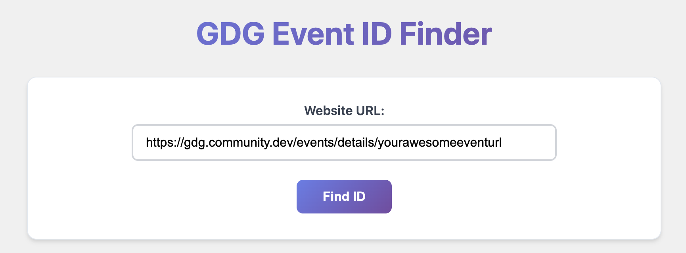
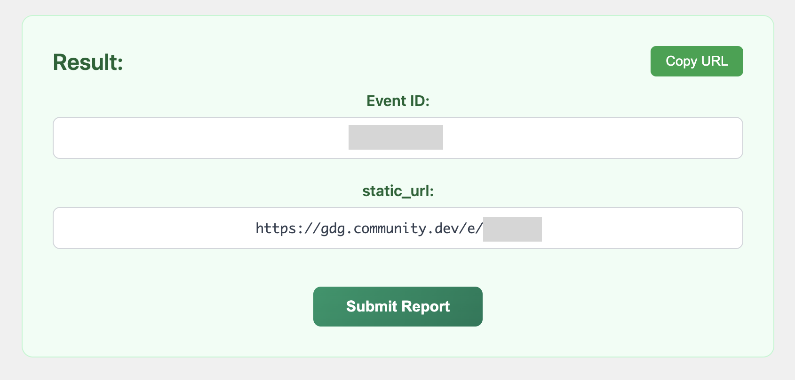

# GDG Event ID Finder & Report Submission Service

A lightweight web app that helps Google Developer Groups (GDG) organizers quickly retrieve an event's **Event ID** and jump straight to the official **Post-Event Report** form.




---

## ✨ Why?

- **Forgot to submit your event report?** We've all been there.
- **Need the Event ID in a hurry?** No more digging through DevSite or page source.

Just paste the event URL and let the app do the rest—find the ID and give you a one-click link to the post-event survey.

```text
Example URL
https://gdg.community.dev/events/details/YOUR_AWESOME_EVENT_URL/
```

---

## 🚀 Features

1. **Event ID Extraction** – Parses the `__NEXT_DATA__` JSON embedded in GDG event pages to grab the `static_url` and Event ID.
2. **Direct Report Link** – Generates `https://gdg.community.dev/e/<EVENT_ID>/survey/post_event_team` and opens it in a new tab.
3. **Clipboard Copy** – Copy the `static_url` with a single click.
4. **Debug Logs** – Built-in log panel for transparency and troubleshooting.
5. **Serverless Proxy** – Uses a Netlify Function (`/.netlify/functions/proxy`) to bypass CORS safely in production.

---

## 🛠️ Local Development

```bash
# Install dependencies
npm install

# Start dev server
npm run dev
```

Open `http://localhost:5173` (or the port shown in your terminal).

### Lint & Type-Check

```bash
npm run lint
```

### Build for Production

```bash
npm run build
```

The static site is output to `dist/`.

---

## 📄 License

FREE TO USE, © 2025
[EunHyeok Jung](https://linked.in/eunhyeok-jung)

---

Made with ❤️ for GDG organizers everywhere. Link back or contribute if you find it useful!
